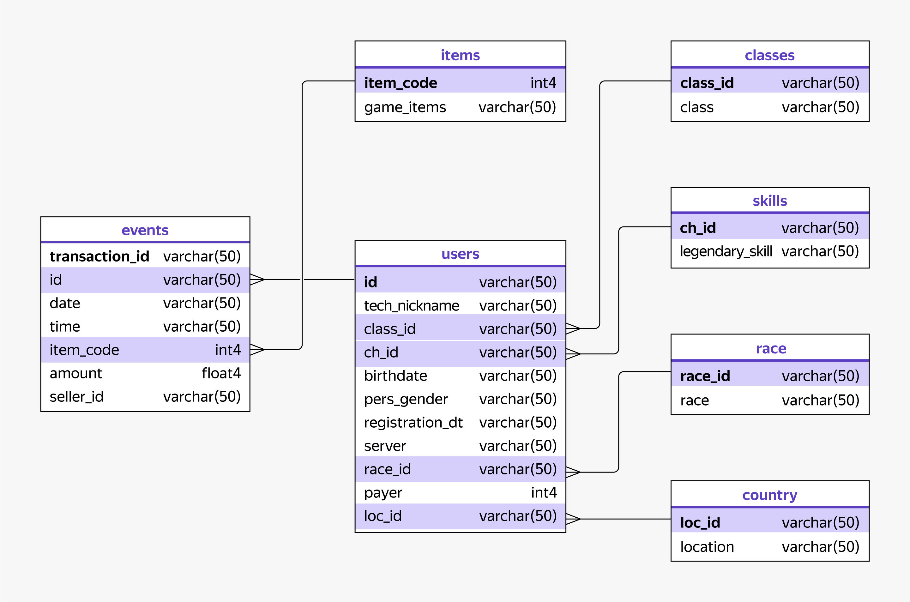

# Проект: «Секреты Тёмнолесья»

## Описание проекта

Проект посвящён анализу игрового поведения пользователей MMORPG «Секреты Тёмнолесья».

Цель исследования — изучить влияние характеристик игроков и их игровых персонажей на покупку внутриигровой валюты «райские лепестки», а также оценить активность игроков при совершении внутриигровых покупок.

## Задачи исследования

**Исследовательский анализ данных**

- определить долю платящих игроков;
- сравнить долю платящих игроков между расами персонажей;
- исследовать характеристики внутриигровых покупок;
- выявить аномальные транзакции;
- определить наиболее популярные эпические предметы.

**Ad hoc-задача**

Проверить, зависит ли покупательская активность игроков от выбранной расы персонажа.

## Используемые инструменты

- PostgreSQL
- SQL
- JOIN
- CTE
- Агрегирующие функции
- Статистические функции

## Структура данных

Ниже представлена схема базы данных, использованной в проекте.

В ходе анализа преимущественно использовались следующие таблицы:

- users — информация об игроках;
- events — история внутриигровых покупок;
- items — справочник игровых предметов;
- race — справочник рас персонажей.

## Основные результаты

**Платящие игроки**

- Платящими являются 18% игроков.
- Доля платящих игроков по расам находится в диапазоне 17–19%.
- Существенных различий в доле платящих игроков между расами не выявлено.

**Внутриигровые покупки**

- Всего совершено 1 307 678 покупок.
- Общая сумма покупок составила 686 615 040 единиц игровой валюты.
- Минимальная стоимость покупки — 0.
- Максимальная стоимость покупки — 486 615,1.
- Средняя стоимость покупки — 525,7.
- Медианная стоимость покупки — 74,9.
- Стандартное отклонение — 2517,3.

Средняя стоимость покупки значительно выше медианной, что указывает на наличие большого количества недорогих покупок и небольшого числа крупных транзакций.

**Аномальные транзакции**

- Обнаружено 907 покупок с нулевой стоимостью.
- Их доля составляет 0,07% от общего количества транзакций.

Так как доля нулевых покупок мала, они практически не влияют на общие результаты анализа.

**Популярные эпические предметы**

Наиболее популярными эпическими предметами стали:

1. Book of Legends
   - 1 004 516 покупок;
   - 77% всех покупок эпических предметов.

2. Bag of Holding
   - 271 875 покупок;
   - 21% всех покупок эпических предметов.

3. Necklace of Wisdom
   - 13 828 покупок;
   - около 1% всех покупок эпических предметов.

**Активность игроков по расам**

Доля игроков, совершивших хотя бы одну покупку предмета, по расам находится в диапазоне примерно 60–63%:
- Demon — 59,97%;
- Elf — 61,70%;
- Angel — 61,79%;
- Human — 61,96%;
- Hobbit — 62,12%;
- Northman — 62,58%;
- Orc — 62,89%.

Разница между минимальным и максимальным значением составляет менее 3 процентных пунктов, поэтому вовлечённость игроков разных рас в покупки можно считать сопоставимой.

При этом различается интенсивность покупок и объём расходов:
- игроки расы Human совершают больше всего покупок — в среднем 121,4 покупки на одного покупателя;
- игроки расы Northman имеют самый высокий средний чек — 761,5;
- игроки расы Northman также демонстрируют наибольшие средние суммарные расходы — 62 522,21 на одного покупателя.

## Выводы

Анализ показал, что различия между расами по доле игроков, совершающих покупки, минимальны. Однако расы заметно отличаются по количеству покупок и объёму расходов.

Игроки расы Human чаще совершают покупки, а игроки расы Northman в среднем тратят больше игровой валюты.

Полученные результаты могут быть использованы для дальнейшего анализа игровой экономики, балансировки игровых механик и развития монетизации.

## Практические рекомендации

По результатам анализа можно предложить следующие направления для дальнейшего исследования и развития игрового продукта:

- Доля платящих игроков составляет около 18%, что указывает на потенциал для развития механик монетизации и привлечения новых платящих пользователей.
- Несмотря на схожую долю игроков, совершающих покупки, между расами наблюдаются различия в количестве покупок и объёме расходов. Для более глубокого понимания поведения игроков рекомендуется дополнительно исследовать факторы, влияющие на эти различия.
- Игроки расы Human совершают наибольшее количество покупок, а игроки расы Northman демонстрируют максимальный объём расходов. Эти сегменты могут быть дополнительно исследованы для разработки персонализированных игровых предложений и оценки эффективности механик монетизации.

## Файлы проекта

- dark_forest_analysis.sql — SQL-запросы проекта;
- README.md — описание проекта;
