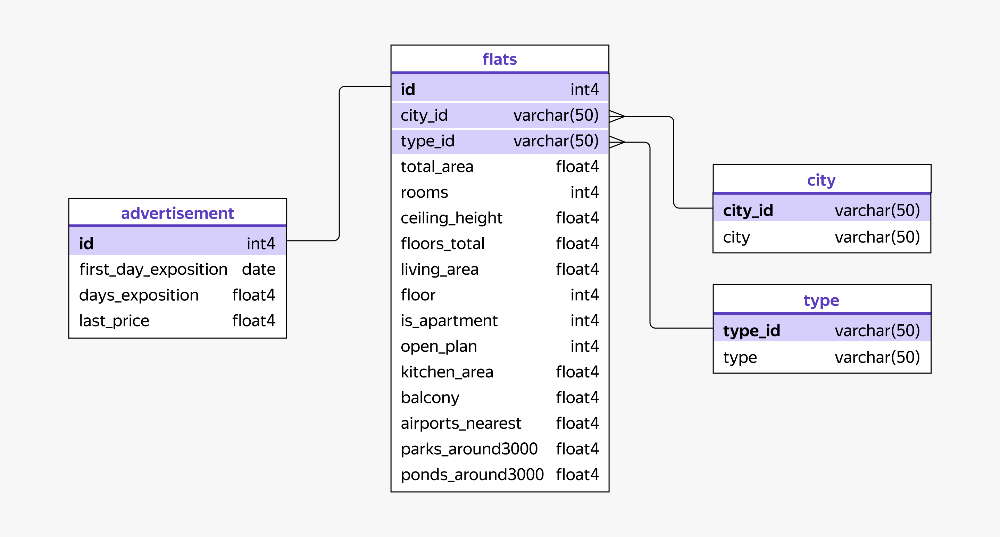

# Анализ рынка недвижимости

## Описание проекта

Проект посвящён анализу рынка жилой недвижимости Санкт-Петербурга и Ленинградской области.

Цель исследования — выявить особенности активности объявлений о продаже недвижимости, определить влияние характеристик объектов на скорость продажи и изучить сезонность рынка для поддержки бизнес-решений агентства недвижимости.

## Задачи исследования

### Время активности объявлений

- определить наиболее распространённые категории объявлений по сроку размещения;
- изучить влияние характеристик объектов недвижимости на длительность продажи;
- сравнить особенности рынка Санкт-Петербурга и Ленинградской области.

### Сезонность объявлений

- определить месяцы максимальной активности публикации объявлений;
- определить месяцы максимальной активности продаж недвижимости;
- изучить влияние сезонности на стоимость квадратного метра и площадь объектов.

- ## Используемые инструменты

- PostgreSQL
- SQL
- CTE
- JOIN
- CASE
- Агрегирующие функции
- Оконные и статистические функции
- PERCENTILE_DISC
- PERCENTILE_CONT

## Структура данных

Ниже представлена схема базы данных, использованной в проекте.

В ходе анализа использовались следующие таблицы:

- flats — характеристики объектов недвижимости;
- advertisement — информация по объявлениям и срокам размещения;
- city — справочник населённых пунктов;
- type — тип населённого пункта.

Все перечисленные таблицы использовались при решении аналитических задач проекта.

## Основные результаты

### Время активности объявлений

- Наиболее распространёнными являются объявления, размещённые на площадке более 6 месяцев.
- В Ленинградской области больше всего объявлений находится в категориях от 1 до 3 месяцев и более 6 месяцев.
- В Санкт-Петербурге также преобладают объявления со сроком размещения более 6 месяцев.

Выявлено, что длительность продажи связана прежде всего с площадью объекта и стоимостью квадратного метра.

Для Ленинградской области характерно увеличение срока продажи с ростом площади объекта. Более дорогие по стоимости квадратного метра объекты в среднем продаются быстрее.

В Санкт-Петербурге быстрее продаются квартиры меньшей площади и с более низкой стоимостью квадратного метра.

Количество комнат, балконов и этажность практически не меняются между категориями объявлений, поэтому их влияние на скорость продажи оказалось менее заметным.

### Сезонность рынка недвижимости

- Максимальная активность публикации объявлений наблюдается в октябре и ноябре.
- Максимальная активность продаж также приходится на октябрь и ноябрь.

Таким образом, наиболее активным периодом на рынке недвижимости является осенний сезон.

Средняя стоимость квадратного метра изменяется незначительно в течение года, а сезонность практически не влияет на уровень цен.

Средняя площадь объектов также остаётся относительно стабильной и не демонстрирует выраженной сезонной зависимости.

### Сравнение Санкт-Петербурга и Ленинградской области

- Средняя стоимость квадратного метра в Санкт-Петербурге почти в 2 раза выше.
- Средняя этажность объектов в Санкт-Петербурге примерно вдвое выше.
- Количество объявлений в Санкт-Петербурге более чем в 2 раза превышает показатели Ленинградской области.

Это свидетельствует о более крупном и активном рынке недвижимости Санкт-Петербурга.

## Выводы

Анализ показал, что значительная часть объектов недвижимости находится в продаже более 6 месяцев, что может свидетельствовать о высокой конкуренции на рынке и завышенных ожиданиях продавцов относительно стоимости объектов.

На скорость продажи в большей степени влияют площадь объекта и стоимость квадратного метра, тогда как количество комнат, балконов и этажность оказывают менее заметное влияние.

Рынок Санкт-Петербурга отличается более высокой стоимостью недвижимости, большим количеством объектов и более высокой активностью по сравнению с Ленинградской областью.

## Практические рекомендации

- При планировании маркетинговых кампаний особое внимание рекомендуется уделять осеннему периоду, когда наблюдается максимальная активность как продавцов, так и покупателей.
- Для ускорения продажи объектов рекомендуется учитывать влияние площади и стоимости квадратного метра на сроки реализации.
- При анализе эффективности объявлений целесообразно отдельно рассматривать Санкт-Петербург и Ленинградскую область, поскольку характеристики рынков существенно различаются.
- Дополнительного исследования заслуживают причины длительного нахождения значительной части объектов на рынке.

## Файлы проекта

- real_estate_analysis.sql — SQL-запросы проекта;
- README.md — описание проекта;
- schema.png — схема базы данных.
