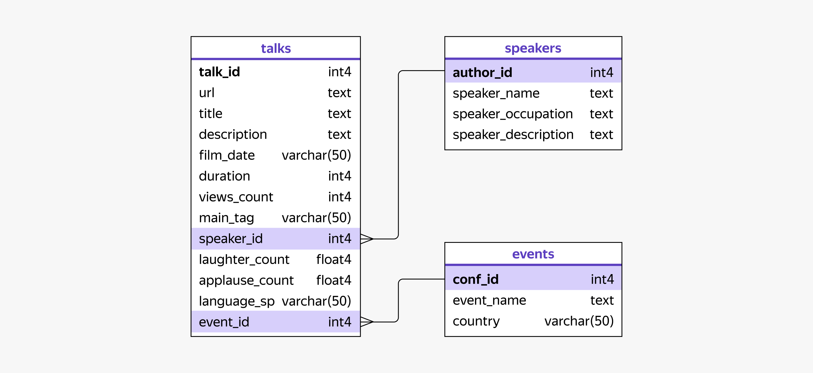

# Анализ конференций TED

## Описание проекта

Проект посвящён анализу данных конференций TED и разработке интерактивного дашборда в DataLens.

Цель проекта — изучить характеристики успешных конференций и выступлений TED, выявить популярные темы и определить факторы, влияющие на интерес аудитории.

## Бизнес-задача

Компания приобрела лицензию на проведение конференций TED и планирует организовать собственное мероприятие.

Для подготовки конференции необходимо изучить опыт ранее проведённых мероприятий TED, определить наиболее востребованные темы выступлений, оценить реакцию аудитории и выявить характеристики успешных спикеров.

## Задачи проекта

- проанализировать конференции TED;
- определить популярные темы выступлений;
- исследовать реакцию аудитории на выступления;
- изучить характеристики успешных спикеров;
- определить среднюю длительность выступлений;
- оценить структуру и масштаб конференций;
- разработать интерактивный дашборд для анализа данных.

## Используемые инструменты

- SQL
- PostgreSQL
- DataLens
- Анализ данных
- Агрегирование данных
- Визуализация данных
- Разработка интерактивного дашборда

## Структура данных

Ниже представлена схема базы данных проекта.

## Дашборд

Интерактивный дашборд доступен по ссылке:

[Открыть дашборд в DataLens](https://datalens.yandex/mm73wew8hk746)

## Возможности дашборда

Дашборд позволяет:
- анализировать количество конференций, выступлений и спикеров;
- исследовать популярность тем и тегов TED;
- оценивать реакцию аудитории по просмотрам, аплодисментам и смеху;
- сравнивать конференции по странам проведения;
- анализировать характеристики выступающих;
- просматривать детальную информацию по каждому выступлению.

Для удобства предусмотрены фильтры по:
- стране;
- конференции;
- тегу выступления;
- дате записи.

## Основные результаты

- Определены наиболее популярные темы и теги выступлений TED.
- Проанализированы показатели просмотров, аплодисментов и реакции аудитории на выступления.
- Выявлены характеристики наиболее успешных выступлений и спикеров.
- Исследована структура конференций TED по странам проведения и составу участников.
- Разработан интерактивный дашборд для анализа данных и поддержки принятия решений при организации конференций.

## Файлы проекта

- README.md — описание проекта;
- schema.png — схема базы данных;
- Ссылка на DataLens — интерактивный дашборд проекта.
